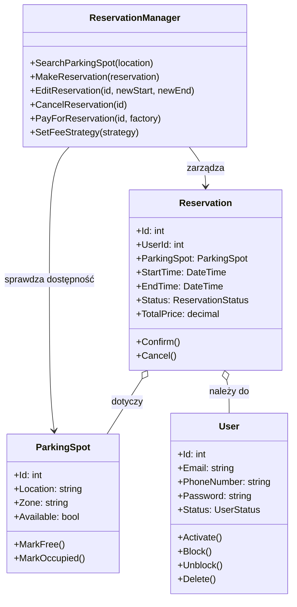
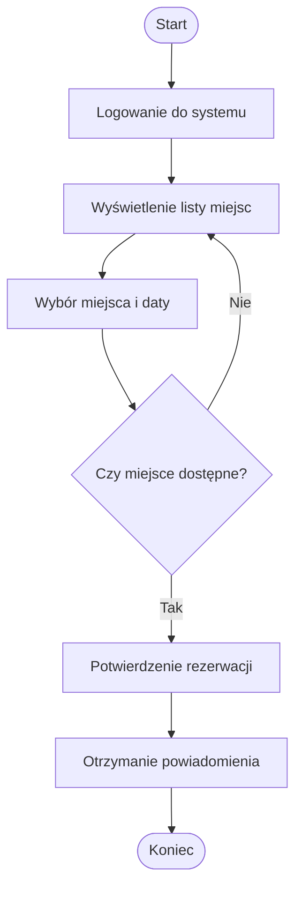
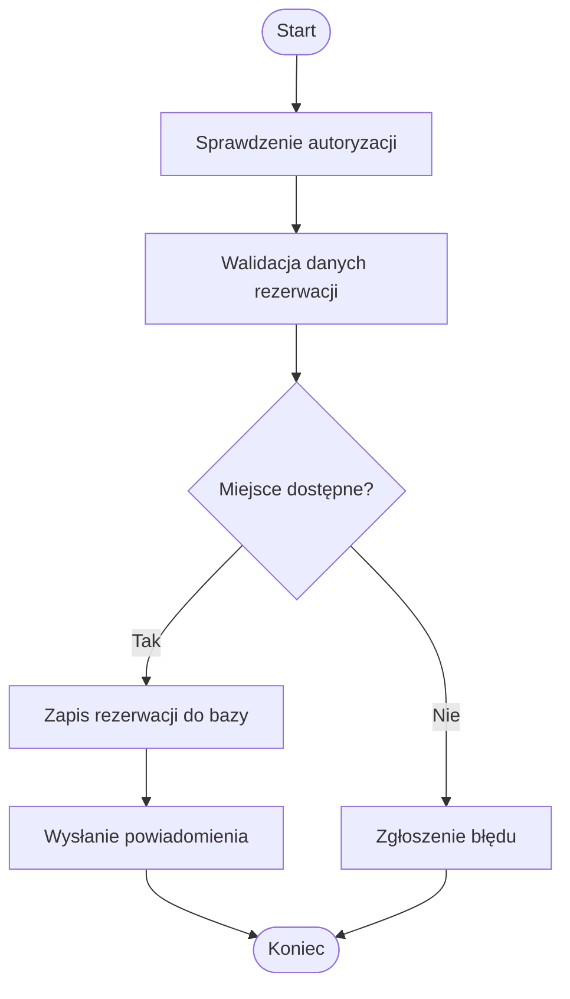
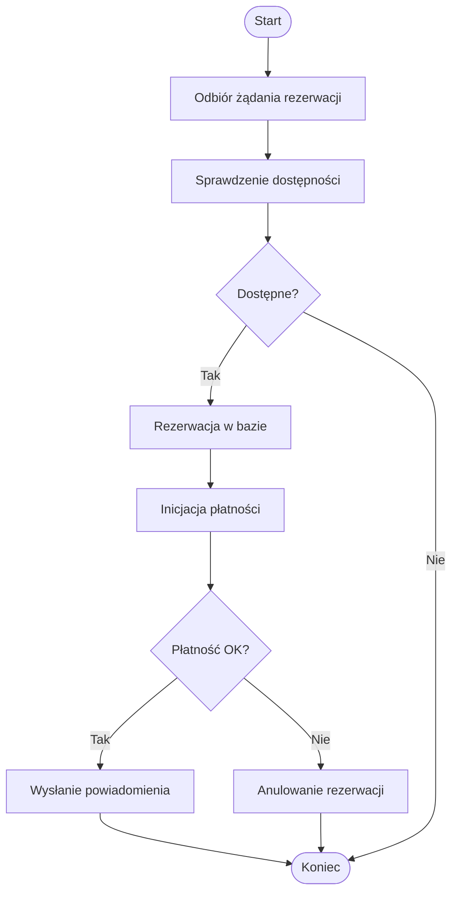
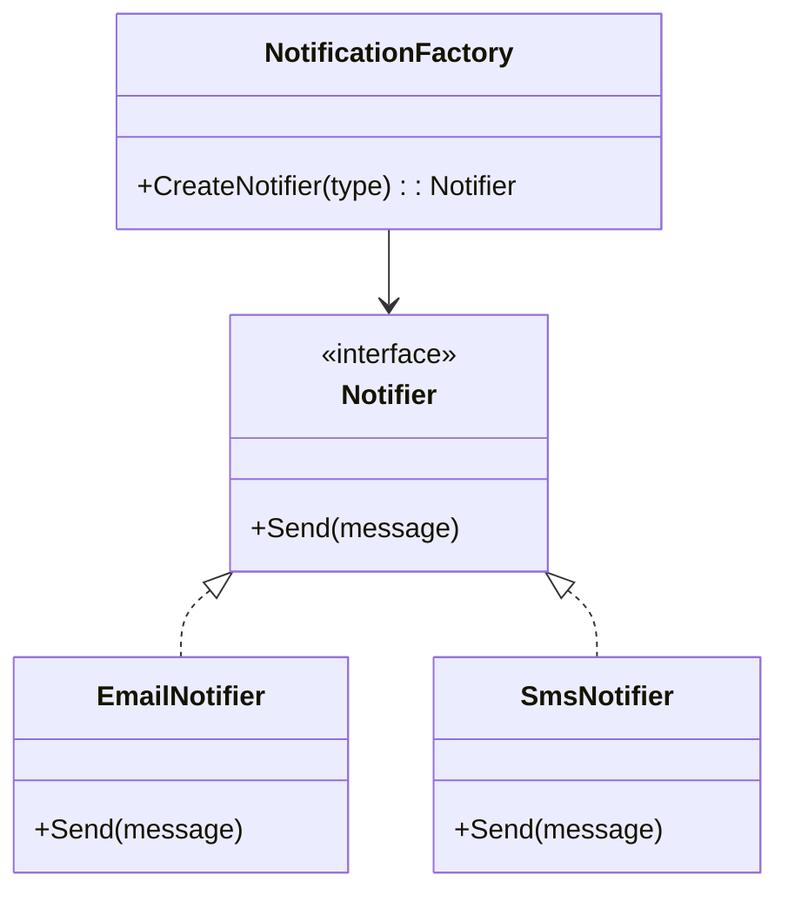
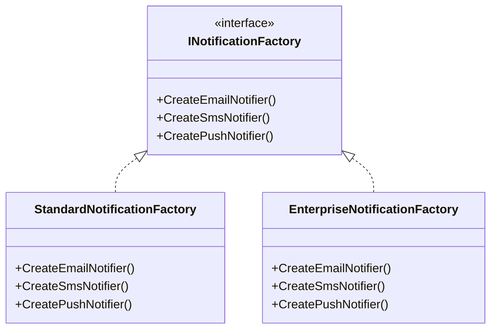
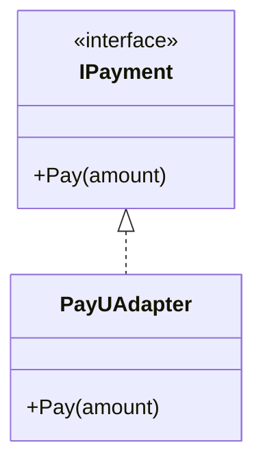
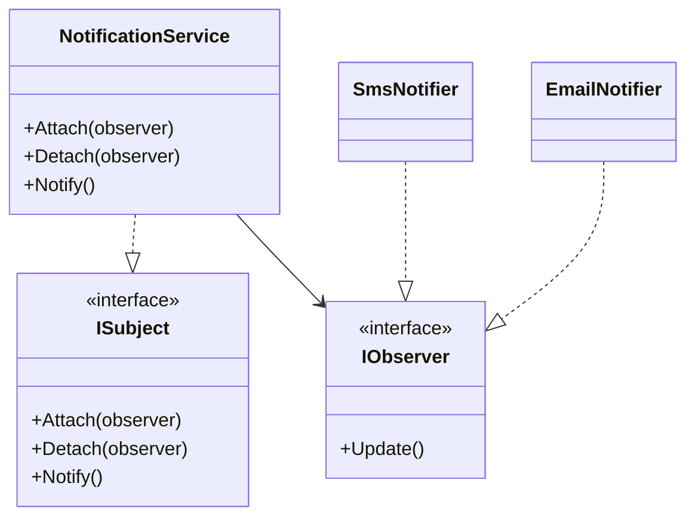
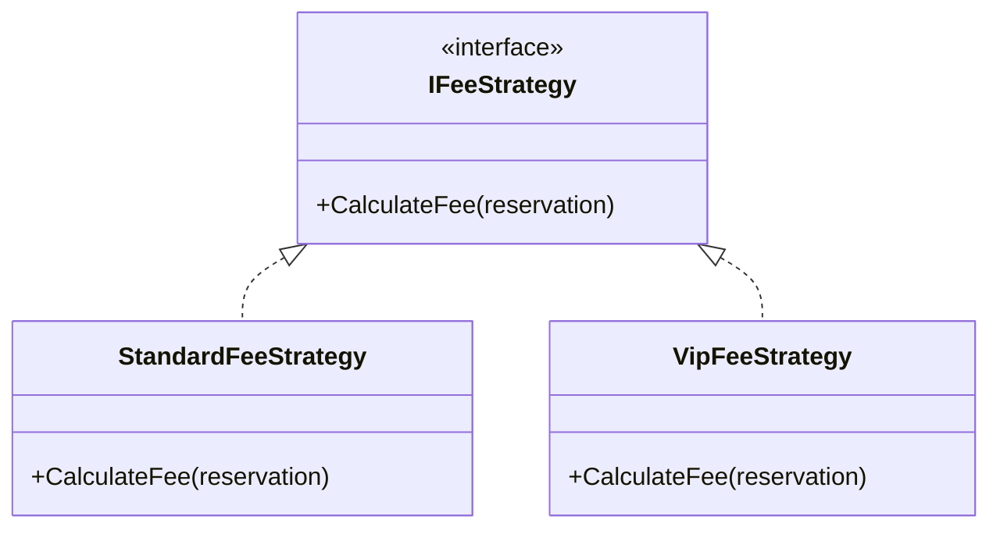
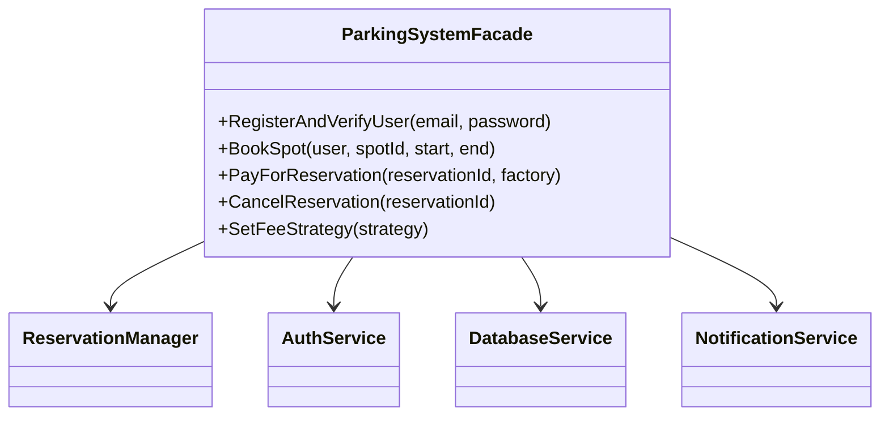

# System Parkingowy – Dokumentacja techniczna i projektowa

---

## Spis treści
1. [Opis systemu i użytkowników](#opis-systemu-i-użytkowników)
2. [Ograniczenia i wymagania niefunkcjonalne](#ograniczenia-i-wymagania-niefunkcjonalne)
3. [Analiza danych i środowiska](#analiza-danych-i-środowiska)
4. [Wymagania funkcjonalne i niefunkcjonalne](#wymagania-funkcjonalne-i-niefunkcjonalne)
5. [Opis działania systemu (na podstawie Program.cs)](#opis-działania-systemu-na-podstawie-programcs)
6. [Diagram przypadków użycia UML](#diagram-przypadków-użycia-uml)
7. [Architektura systemu – diagram komponentów UML](#architektura-systemu--diagram-komponentów-uml)
8. [Diagram klas UML (przykład)](#diagram-klas-uml-przykład)
9. [Diagramy aktywności UML](#diagramy-aktywności-uml)
10. [Wzorce projektowe – analiza i dobór](#wzorce-projektowe--analiza-i-dobór)
11. [Diagramy klas wzorców projektowych](#diagramy-klas-wzorców-projektowych)
12. [Implementacja wzorców w systemie](#implementacja-wzorców-w-systemie)
13. [Typy kodu, technologie, narzędzia](#typy-kodu-technologie-narzędzia)

---

## Struktura projektu – dodatkowe części

### System-Parkingowy-Lib-

- Zawiera logikę biznesową systemu parkingowego w formie biblioteki.
- Udostępnia klasy, interfejsy i implementacje modułów: rezerwacji, płatności, powiadomień, autoryzacji, bazy danych.
- W katalogu `Tests/SystemParkingowy.Tests/` znajdują się testy jednostkowe i integracyjne dla kluczowych komponentów:
  - `AuthServiceTests.cs` – testy autoryzacji i rejestracji użytkowników.
  - `BookingServiceTests.cs` – testy procesu rezerwacji.
  - `NotificationServiceTests.cs` – testy powiadomień.
  - `PaymentProcessorTests.cs` – testy obsługi płatności.
- Biblioteka jest wykorzystywana przez aplikację konsolową oraz przez API.

#### Uruchamianie testów

```sh
cd System-Parkingowy-Lib-/Tests/SystemParkingowy.Tests
# .NET CLI:
dotnet test
```


#### Pokrycie testów (coverage)

Po uruchomieniu testów generowany jest raport pokrycia w pliku `coverage.xml` oraz w katalogu `coverage-report/`.

**Miejsce na zrzut ekranu z raportu pokrycia:**


### System-Parkingowy-API

- Udostępnia funkcjonalność systemu parkingowego przez REST API.
- Implementuje kontrolery:
  - `ParkingSpotController` – zarządzanie miejscami parkingowymi.
  - `ReservationController` – obsługa rezerwacji.
  - `AuthController` – rejestracja, logowanie, autoryzacja.
  - `UserController` – zarządzanie kontami użytkowników.
  - `PaymentController` – obsługa płatności.
  - `PredictionController` – przewidywanie dostępności miejsc.
  - `SensorController` – integracja z czujnikami parkingowymi.
  - `SimulationController` – symulacje działania systemu.
- API korzysta z logiki biznesowej z biblioteki System-Parkingowy-Lib-.

#### Dokumentacja API (Swagger)

Po uruchomieniu projektu API dostępna jest dokumentacja Swagger pod adresem: http://localhost:5000/swagger/index.html


### System-Parkingowy-Console-

- Aplikacja konsolowa korzystająca z biblioteki.


## Opis systemu i użytkowników

System parkingowy służy do zarządzania rezerwacjami miejsc parkingowych w firmie lub instytucji. Pozwala użytkownikom na rejestrację, logowanie, przeglądanie dostępnych miejsc, dokonywanie rezerwacji, płatności oraz otrzymywanie powiadomień.

**Aktorzy systemu:**
- **Użytkownik (Pracownik/Gość):**
  - Rejestruje konto
  - Loguje się do systemu
  - Przegląda dostępność miejsc parkingowych
  - Rezerwuje miejsce parkingowe
  - Anuluje rezerwację
  - Otrzymuje powiadomienia (email, SMS, push)
  - Dokonuje płatności za rezerwację (BLIK, karta, PayPal)
- **Administrator:**
  - Zarządza użytkownikami
  - Zarządza miejscami parkingowymi
  - Przegląda statystyki i raporty
  - Konfiguruje powiadomienia i płatności

---

## Ograniczenia i wymagania niefunkcjonalne

- System musi być zgodny z RODO (ochrona danych osobowych)
- Dostępność 24/7, wysoka niezawodność
- Bezpieczeństwo: szyfrowanie danych, autoryzacja, logowanie zdarzeń
- Wydajność: obsługa min. 100 jednoczesnych użytkowników
- Skalowalność: możliwość rozbudowy o kolejne parkingi/lokalizacje
- Integracja z zewnętrznymi systemami płatności i powiadomień
- Możliwość wdrożenia w chmurze lub lokalnie
- Wsparcie dla urządzeń mobilnych i desktopowych

---

## Analiza danych i środowiska

- Liczba użytkowników: do 200 (pracownicy, goście, administratorzy)
- Przetwarzane dane: dane osobowe, rezerwacje, płatności, powiadomienia
- Lokalizacja: siedziba firmy, możliwość pracy zdalnej (VPN)
- Sprzęt: serwer Windows/Linux, komputery pracowników, smartfony
- Oprogramowanie: .NET Core, MS SQL/PostgreSQL, SMTP, API płatności
- Możliwość integracji z systemami kontroli dostępu (szlabany, RFID)

---

## Wymagania funkcjonalne i niefunkcjonalne

### Wymagania funkcjonalne

1. Rejestracja i logowanie użytkowników
2. Przeglądanie dostępnych miejsc parkingowych
3. Rezerwacja i anulowanie rezerwacji
4. Obsługa płatności online (BLIK, karta, PayPal)
5. Wysyłka powiadomień (email, SMS, push)
6. Zarządzanie użytkownikami i miejscami (admin)
7. Generowanie raportów i statystyk
8. Integracja z systemami zewnętrznymi (API)

### Wymagania niefunkcjonalne

1. Bezpieczeństwo danych (RODO, szyfrowanie, autoryzacja)
2. Wydajność i skalowalność
3. Niezawodność i dostępność 24/7
4. Przenośność (chmura/lokalnie)
5. Łatwość obsługi (UI/UX)
6. Zgodność z przepisami prawa
7. Możliwość rozbudowy i integracji

---

## Opis działania systemu (na przykładzie Program.cs)


System uruchamia się poprzez klasę `Program` i korzysta z fasady `ParkingSystemFacade`, która upraszcza interakcję z głównymi modułami systemu:

1. **Rejestracja i weryfikacja użytkownika:**
   - Użytkownik podaje email i hasło.
   - System rejestruje użytkownika i automatycznie weryfikuje konto.
   - Dane użytkownika są zapisywane w bazie danych.
2. **Rezerwacja miejsca parkingowego:**
   - Użytkownik wybiera miejsce, datę i godzinę.
   - System sprawdza dostępność miejsca i tworzy rezerwację.
   - Rezerwacja jest zapisywana w bazie danych.
   - Użytkownik otrzymuje powiadomienie o rezerwacji.
3. **Zmiana strategii opłat:**
   - Administrator lub system może ustawić inną strategię naliczania opłat (np. dla VIP).
4. **Płatność za rezerwację:**
   - Użytkownik wybiera metodę płatności (BLIK, karta, PayPal).
   - System przetwarza płatność przez odpowiedni moduł.
   - Po opłaceniu rezerwacji użytkownik otrzymuje powiadomienie.
5. **Anulowanie rezerwacji:**
   - Użytkownik może anulować rezerwację, a system aktualizuje status i powiadamia użytkownika.

**Przykładowy scenariusz (z Program.cs):**
- Użytkownik rejestruje się i weryfikuje konto.
- Rezerwuje miejsce parkingowe na wybrany termin.
- Zmienia strategię opłat na VIP.
- Rezerwuje kolejne miejsce na inny termin.

- 

---

## Diagram klas UML (przykład – Moduł Rezerwacji)



---

## Diagramy aktywności UML

### a) Scenariusz użytkownika (UI-perspective) – Rezerwacja miejsca



### b) Logika systemu (System-perspective) – Rezerwacja miejsca



### c) Proces techniczny (Backend/serwis) – Rezerwacja i płatność



---

## Wzorce projektowe – analiza i dobór

W projekcie zastosowano następujące wzorce projektowe:
- **Factory Method:** Tworzenie różnych typów powiadomień (Email, SMS, Push)
- **Abstract Factory:** Tworzenie rodzin powiązanych obiektów powiadomień (Standard/Enterprise)
- **Adapter:** Integracja z zewnętrznymi systemami płatności (np. PayU)
- **Observer:** Powiadamianie wielu odbiorców o zmianach rezerwacji
- **Strategy:** Różne strategie naliczania opłat (np. Standard, VIP)
- **Facade:** Uproszczenie interfejsu do głównych funkcji systemu (ParkingSystemFacade)

---

## Diagramy klas wzorców projektowych

### Factory Method (Notifier)



### Abstract Factory (NotificationFactory)



### Adapter (PayUAdapter)



### Observer (NotificationService)



### Strategy (FeeStrategy)



### Facade (ParkingSystemFacade)



---

## Typy kodu, technologie, narzędzia

- **Język:** C# (.NET Core)
- **Baza danych:** MS SQL Server / PostgreSQL
- **Wzorce projektowe:** Factory Method, Abstract Factory, Adapter, Observer, Strategy, Facade
- **Diagramy:** UML (Mermaid, PlantUML)
- **Powiadomienia:** Email (SMTP), SMS, Push
- **Płatności:** BLIK, Karta, PayPal, PayU (Adapter)
- **Testy:** xUnit/NUnit (propozycja)
- **Narzędzia:** Visual Studio, Git, Mermaid Live Editor

---
